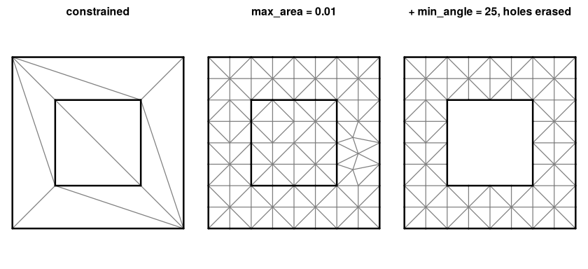
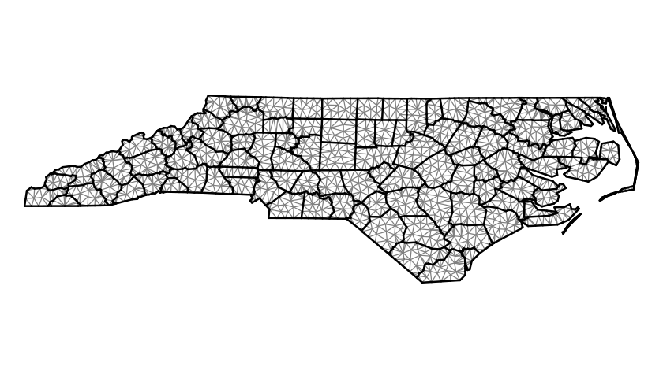

# cdtr

Constrained Delaunay triangulation with refinement for R, binding the
header-only [CDT](https://github.com/artem-ogre/CDT) library (MPL-2.0).
It takes the same input as a planar straight line graph (vertices,
segments as index pairs, optional per-vertex attributes) and returns
vertices, triangles, and a per-triangle *depth* that says where each
triangle sits relative to the constraints, with no point-in-polygon
step.

``` r

remotes::install_github("hypertidy/cdtr")
```

## The pipeline, on a toy

Vertices and segments in, vertices and triangles out. Here a square with
a square hole: two closed rings of segments.

``` r

library(cdtr)
x <- c(0, 1, 1, 0, 0.25, 0.75, 0.75, 0.25)
y <- c(0, 0, 1, 1, 0.25, 0.25, 0.75, 0.75)
s0 <- 1:8; s1 <- c(2, 3, 4, 1, 6, 7, 8, 5)
r <- cdt_triangulate(x, y, s0, s1)
str(r[c("P", "T", "S", "depth")])
#> List of 4
#>  $ P    : num [1:8, 1:2] 0 1 1 0 0.25 0.75 0.75 0.25 0 0 ...
#>  $ T    : int [1:10, 1:3] 8 6 8 7 6 5 8 6 2 2 ...
#>  $ S    : int [1:8, 1:2] 1 3 1 5 6 2 7 5 2 4 ...
#>  $ depth: int [1:10] 2 1 1 1 2 1 1 1 1 1
```

`depth` is the number of constraint boundaries crossed on the way in
from outside: 0 is outside everything, and for nested rings odd is
inside, even is a hole. By default triangles outside the outermost
boundary are already dropped (`erase = "outer"`, which is what
Triangle’s `-p` does); `erase = "holes"` also drops the even depths.

``` r

plot_mesh <- function(m, main = "") {
  e <- cdt_edges(m)
  plot(m$P, asp = 1, axes = FALSE, xlab = "", ylab = "", pch = ".", main = main)
  segments(m$P[e[, 1], 1], m$P[e[, 1], 2], m$P[e[, 2], 1], m$P[e[, 2], 2], col = "grey50")
  segments(m$P[m$S[, 1], 1], m$P[m$S[, 1], 2], m$P[m$S[, 2], 1], m$P[m$S[, 2], 2], lwd = 2)
}
op <- par(mfrow = c(1, 3), mar = c(0.5, 0.5, 2, 0.5))
plot_mesh(r, "constrained")
plot_mesh(cdt_triangulate(x, y, s0, s1, max_area = 0.01), "max_area = 0.01")
plot_mesh(cdt_triangulate(x, y, s0, s1, max_area = 0.01, min_angle = 25, erase = "holes"),
          "+ min_angle = 25, holes erased")
```



``` r

par(op)
```

## Refinement reports what it could not do

Ruppert refinement cannot always meet the bound (two constraints meeting
at a sharp angle, say). Rather than silently stopping, the result
carries the counts.

``` r

r2 <- cdt_triangulate(x, y, s0, s1, max_area = 0.01, min_angle = 25)
r2$unrefined
#>   criterion shortEdgeTriangles circumcenterOutside circumcenterOnVertex
#> 1      area                  0                   0                    0
#> 2     angle                  0                   0                    0
#>   sharpFixedCorner shortEdges splitVertexInvalid
#> 1                0          0                  0
#> 2                0          0                  0
r2$min_edge_length
#> [1] 0.025
```

`min_edge_length` is the floor below which the refiner gives up on an
edge; by default it is derived from the input (a fraction of the median
segment length, capped by the area target) so refinement does not
cascade into sharp input corners. Pass `0` for never-give-up.

## Real polygons

Any polygon source reduces to the same two tables. With `sf`’s North
Carolina counties, rings become vertex runs and consecutive index pairs;
shared boundaries dedupe to one segment.

``` r

nc <- sf::st_read(system.file("shape/nc.shp", package = "sf"), quiet = TRUE)
rings <- unlist(lapply(sf::st_geometry(nc), function(g) lapply(unclass(g), `[[`, 1)), recursive = FALSE)
xy <- do.call(rbind, lapply(rings, function(m) m[-nrow(m), ]))
n <- vapply(rings, function(m) nrow(m) - 1L, 1L)
start <- rep(cumsum(c(0L, n[-length(n)])), n)
s0 <- seq_along(xy[, 1])
s1 <- start + (s0 - start) %% rep(n, n) + 1L
m <- cdt_triangulate(xy[, 1], xy[, 2], s0, s1, max_area = 0.01)
table(m$depth)
#> 
#>    1    3    5 
#> 2100 1119  521
op <- par(mar = rep(0, 4))
plot_mesh(m)
```



``` r

par(op)
```

The counties tile the state, so there are no holes, but a county two
boundaries in from the coast has depth 3, and so on: depth is the peel
layer, a count of constraint crossings from outside, not an
inside/outside flag in general. It is computed topologically from the
mesh alone, before anything is erased, which makes it a cheap first cut
for classifying triangles by region: nested rings get odd/even, a
coverage gets a boundary-distance ordering, and only ties within a layer
need a geometric lookup.

## Attributes ride along

Per-vertex values (an elevation, a time) are carried onto the new
Steiner vertices by linear interpolation from the input mesh, the way
Triangle’s `PA` works.

``` r

z <- 2 * xy[, 1] + 3 * xy[, 2]
ma <- cdt_triangulate_attr(xy[, 1], xy[, 2], s0, s1, PA = cbind(z = z), max_area = 0.01)
range(ma$PA[, "z"] - (2 * ma$P[, 1] + 3 * ma$P[, 2]))
#> [1] -1.421085e-14  1.421085e-14
```

## What this is for

`cdtr` is the triangulation primitive for the hypertidy mesh packages,
where it replaces RTriangle (Shewchuk’s Triangle, non-commercial
licence). The `inst/benchmarks/` scripts compare the two on anglr’s
Tasmanian contour and cadastre data; the short version is that
constrained-only output is identical, refinement honours `max_area`
where Triangle may give up, and Triangle’s refiner is faster per Steiner
point.
